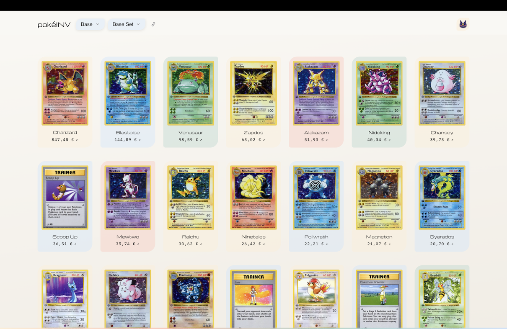

# inv

A Pokémon TCG card browser. Pick an era, pick a set, get the cards with current market prices
from [TCGdex](https://tcgdex.dev).

Live at [inv.siffert.io](https://inv.siffert.io).

<p align="center">
  
</p>

## About this project

This is an old weekend project. It started as an attempt at a mobile-first website and turned into a
card list somewhere along the way. It is not actively maintained and I do not care for it much — I
had an AI rework it so it is not quite as bad as it was. Expect rough edges.

## Running it

```
npm install
npm run dev
```

The site does not call the TCGdex API from the browser. It reads a snapshot of all sets and
cards from `data/`, which `npm run fetch-data` downloads. Run it once before starting the dev server:

```
npm run fetch-data
```

TCGdex needs no API key. Prices are only available per card, so a run requests every card of every
set individually and takes a while. Pokémon TCG Pocket sets are skipped, as they have no market
prices.

## Scripts

```
npm run dev      # dev server on :3030
npm run build    # production build into dist/
npm run start    # serve dist/ on 0.0.0.0:3030 (what the server runs)
npm run preview  # serve dist/ on localhost only
npm run fetch-data  # refresh the set and card snapshot in data/
npm run lint     # eslint
npm run format   # prettier
```

A pre-commit hook runs the formatter and linter.

## Deploying

The server runs `npm start`, which serves the **built** output from `dist/`. Build before
restarting, or there will be nothing to serve:

```
npm install
npm run build
pm2 restart inv
```

`data/` lives outside `dist/`, so a rebuild keeps the snapshot. Refresh it daily with a pm2 cron job,
started once from the repository directory on the server:

```
pm2 start npm --name inv-fetch-data --cron-restart "0 4 * * *" --no-autorestart -- run fetch-data
pm2 save
```

pm2 runs the job once right away, then every day at 04:00. `--no-autorestart` stops pm2 from
restarting it after it exits, and `pm2 save` keeps it across reboots. Check a run with
`pm2 logs inv-fetch-data`, or trigger one by hand with `pm2 restart inv-fetch-data`.

Each file is written to a temporary path and renamed into place, so the site keeps serving the
previous data while a refresh runs, and a failed set keeps its previous file.

`npm run dev` is for local work only. Do not run it as the public server: it ships unbundled source,
and its hot-reload WebSocket makes phones prompt for local network access.

## How it works

- **React + Vite + TypeScript**, SCSS modules for styling.
- **Snapshot** in `data/`: `sets.json` holds every set plus a `generatedAt` timestamp, and
  `cards/<setId>.json` holds each set's cards sorted by trend price. A small Vite plugin serves the
  directory under `/data` in both `dev` and `preview`, with `Cache-Control: no-cache` and an ETag.
- **react-query** fetches the snapshot and persists it to `localStorage` so a revisit is instant.
  The set list is revalidated hourly; card queries are keyed by `generatedAt`, so a new snapshot
  drops the old cards. Only the eight most recently viewed sets are persisted, to stay inside the
  storage quota.
- **Theming** is a `data-theme` attribute on `<html>`. The choice is stored in `localStorage` and
  falls back to the OS preference. An inline script in `index.html` applies it before first paint so
  the page does not flash the wrong theme.
- **Card images** load lazily via the native `loading="lazy"` attribute, with the aspect ratio
  reserved up front so the grid does not shift as they arrive. Cards without an image, or whose
  image fails to load after one retry, show a tinted placeholder with the card name.
- **Links**: the selected set and the open card live in the URL (`/market?set=<setId>&card=<cardId>`),
  so the link buttons next to the set selector and the card title can share them.
- A dot next to a set name means that set is already stored offline.

## Known gaps

- The inventory page is a placeholder and does nothing.
- There is no test suite.
- Prices are whatever the API reports and are not validated, and are at most one refresh old.
